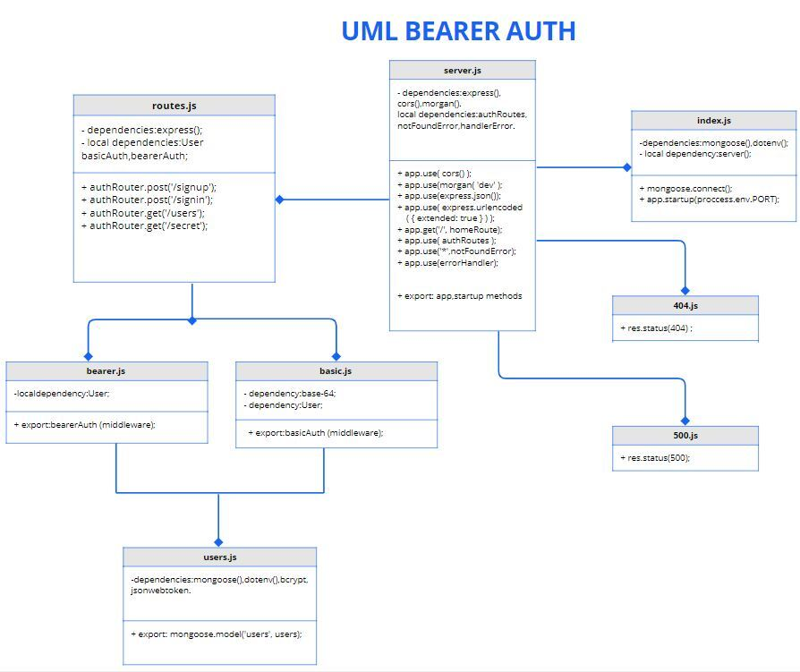

# bearer-auth

### Author: Tamara Alrashed

[Tests Report](https://github.com/Tamaraalrashed/bearer-auth/actions/workflows/node.js.yml)

[Heroku Deployment](https://tamara--bearer-auth.herokuapp.com/)

[Pull Request](https://github.com/Tamaraalrashed/bearer-auth/pull/1)

### Run the app
`npm start`

## **Setup**

 .env requirements
  - PORT - 3000
  - MONGODB_URI
  - SECRET 

### UML Diagram

